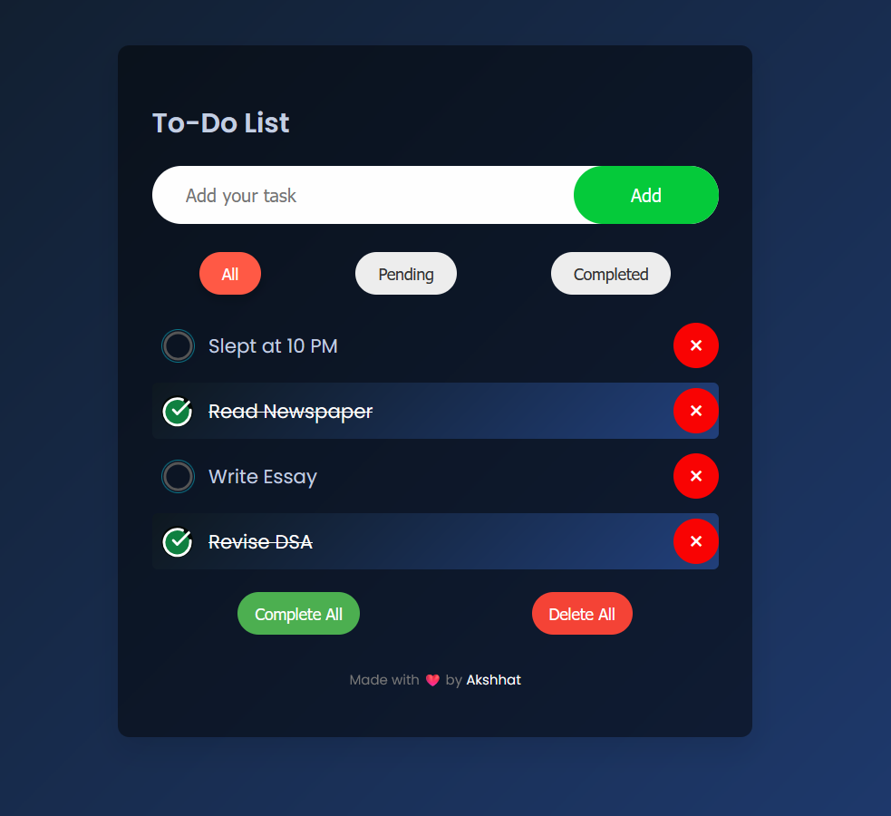

# Modern To-Do List App

A beautiful, responsive To-Do List web application built with pure vanilla JavaScript and CSS. This project demonstrates clean code, modern UI/UX, and interactive features without relying on any frameworks or libraries.

## ✨ Features

- Add, complete, and delete tasks
- Filter tasks by All, Active, and Completed
- Responsive design for mobile and desktop
- Smooth transitions and modern card layout
- Accessible and keyboard-friendly

## 🖼️ Preview



## 🚀 Getting Started

1. **Clone the repository**
   ```sh
   git clone https://github.com/exceptional007/JS-Learning.git
   ```
2. **Navigate to the To-Do app folder**
   ```sh
   cd JS-Learning/07_To-Do/src
   ```
3. **Open `index.html` in your browser**

## 📁 Project Structure

```
07_To-Do/
│   ├── index.html      # Main HTML file
│   ├── styles.css      # Vanilla CSS
│   ├── script.js       # App logic
│   └── ...
└── README.md           # Project documentation
```

## 🎨 Styling

This project uses **pure vanilla CSS** for all styling. No frameworks or external libraries are required. The CSS is written to be clean, maintainable, and modern, with a focus on:

- Flexbox and Grid for layout
- Custom properties for colors and spacing
- Smooth hover and focus effects
- Card-based UI and rounded corners

## 🛠️ Customization

Feel free to modify the styles in `styles.css` to match your own preferences. You can easily change colors, fonts, or layout to create your own unique look.

## 📚 Learning Goals

- Practice DOM manipulation with vanilla JavaScript
- Build a modern UI with pure CSS
- Understand responsive design principles
- Improve accessibility and user experience

## 🤝 Contributing

Contributions are welcome! If you have ideas for improvements or new features, feel free to open an issue or submit a pull request.

## 📄 License

This project is licensed under the MIT License.

---

> Made with ❤️ by exceptional007
